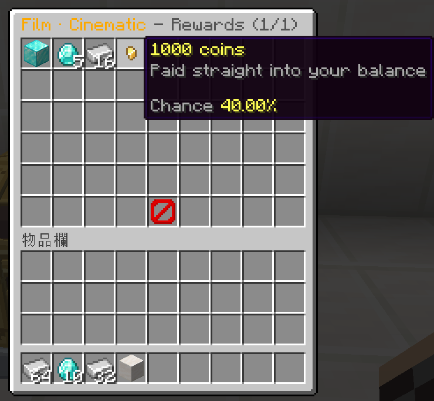

# Rewards and odds

```yaml
rewards:
  diamond_block:
    weight: 2
    broadcast: true                       # announce to the whole server
    message: '&fYou won a &bDiamond Block&f!'
    give:
      '1': { material: DIAMOND_BLOCK, amount: 1 }

  money:
    weight: 40
    message: '&fYou received &e1000 coins'
    display:                              # what the animation shows
      material: GOLD_NUGGET
      display-name: '&e1000 coins'
      lore: ['&7Paid straight into your balance']
    commands:
      - 'eco give %player% 1000'
```

| Key | Meaning |
| --- | --- |
| `weight` | Relative chance. **Not a percentage** — see below. |
| `give` | Items to put in the inventory, as a numbered map |
| `commands` | Console commands to run. `%player%` is the receiver. |
| `display` | What the animation shows. Defaults to the first `give` item. |
| `message` | Sent to the player who opened |
| `broadcast` | `true` announces it server-wide |

A reward may have `give`, `commands`, or both. One with neither is flagged at
load time — it would consume a key and hand back nothing.

## Weights are not percentages

The real chance of a reward is `weight ÷ (sum of all weights)`. With the four
weights `2 + 18 + 40 + 40 = 100` the numbers happen to read as percentages, but
that is a coincidence of the example. Add a fifth reward with weight `100` and
every existing chance halves.

You never have to do that arithmetic:

```
/crate odds starter
```

prints the computed percentages, and the preview screen shows the same numbers
to players.



The chance in that tooltip is derived from the weights every time the screen
is drawn. There is no field to type a number into, so what a player is shown
cannot drift away from what the crate actually does.

## Several rewards per opening

```yaml
rewards-per-open: 3
```

or weighted, so most openings give one and a lucky one gives five:

```yaml
rewards-per-open:
  - { amount: 1, weight: 60 }
  - { amount: 3, weight: 30 }
  - { amount: 5, weight: 10 }
```

Each pull is independent, so the same reward can come up twice.

Every animation stages them natively: the fountain and rain finales erupt with
all of them, the spiral and beam carry them up, the roulette lights up that
many adjacent slots, the GUI strip lines them up under the pointer. The one
exception is `three-toss`, whose stage has exactly three positions — it shows
the first three, still grants the rest, and warns about the combination at load
time.


A crate that grants several rewards at once skips the reroll screen. Choosing
which of three to reroll is a complicated interface for very little gain, and
rerolling the whole set would destroy a milestone reward sitting among them.


## Pity: guaranteed rewards

```yaml
milestones:
  tenth: { every: 10, reward: legendary }   # every 10th opening
  first: { at: 1,     reward: starter_kit } # the very first one
```

`every` repeats; `at` fires once at exactly that count. Progress is counted per
player per crate and stored in the database, so it survives restarts and works
across a network on shared MySQL.

The guaranteed reward takes the first slot of that opening. On a crate that
grants several rewards, the rest are rolled normally around it.

Two rules worth knowing:

* A refused opening does **not** advance the counter — being blocked by a full
  inventory costs the player nothing, including progress.
* Rerolling an opening forfeits its milestone reward. That is deliberate: pity
  is a guarantee, not a lottery you can re-enter.

## Broadcasting

`broadcast: true` announces the reward to the whole server. Use it on the few
rewards that are actually worth announcing — the wording lives in your language
file, so you can change what a broadcast looks like without touching a crate.
