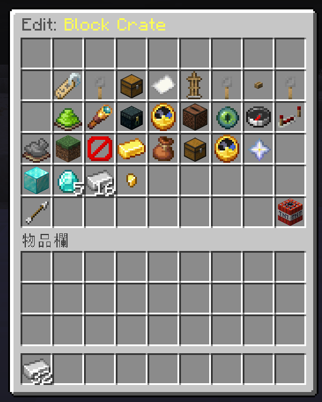

# Your first crate

Ten minutes, no YAML editing. Everything below happens in game.

## 1. Create the crate

```
/crate admin create starter Starter Crate
```

This writes `plugins/CineCrates/crates/starter.yml` with sensible defaults and
opens the editor.



Every button here writes to the crate file, so anything you set in game can
also be edited by hand later — and the other way round.

## 2. Add rewards

Hold the item you want to give away and click **add reward** in the editor, or:

```
/crate admin addreward starter 40
```

The `40` is the weight, not a percentage — see
[Rewards and odds](../crates/rewards.md). Repeat for each reward. The reward id
is derived from the item name, so you do not have to invent one.

## 3. Set the key

Hold the item you want to use as the key and click **set key** in the editor.
The plugin stores it by its own id, so re-texturing or renaming the item later
never invalidates keys already in circulation, and nobody can forge one by
crafting a look-alike.

Prefer a balance over a physical item? Set `key-mode: virtual` in the editor
and grant keys with `/crate key give <player> starter 1` — that works even
while the player is offline.

## 4. Place it in the world

Stand where the crate should sit, facing the way it should face:

```
/crate admin place starter
```

If a model plugin is installed and the crate has a `model:`, you get the 3D
model. Otherwise you get a marker you can still click — or set `block: CHEST`
for an ordinary block.

## 5. Open it

```
/crate key give <yourname> starter 1
```

Right-click the crate. With the default `interact-mode: menu` you get the
preview screen and open from there; left-click opens the preview directly.

## What to change next

| You want | Go to |
| --- | --- |
| A different animation | [Choosing an animation](../animations/overview.md) |
| More than one reward per opening | [Rewards and odds](../crates/rewards.md) |
| A cooldown, a daily cap, or a pity reward | [Keys, pricing and limits](../crates/keys-pricing-limits.md) |
| Money instead of keys | [Keys, pricing and limits](../crates/keys-pricing-limits.md) |
| A full camera shot | [The cinematic shot](../animations/cinematic.md) |

## Editing files directly

Everything the editor does is written to `crates/<id>.yml`, and everything in
that file can be edited by hand. After editing:

```
/crate reload
```

Crates that fail to parse are reported in the console with the crate id and the
line that broke — the rest keep working.
