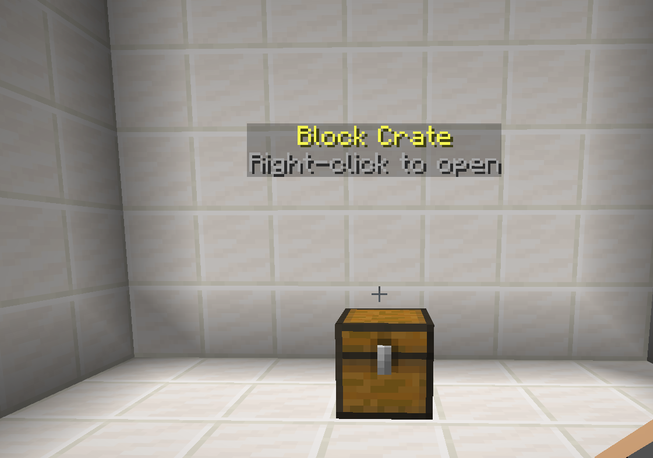

# Block crates

No model plugin, no problem. One line turns the crate into an ordinary block:

```yaml
block: CHEST
```



The block is placed at the placement coordinate when the crate spawns, and
removed when it is unplaced. The floating text above it is the crate's
`hologram:` — block crates and model crates handle it the same way.

Everything else behaves identically — holograms, click handling, every
animation, rewards, keys, limits, the preview screen. Nothing in CineCrates is
gated behind owning a model plugin.

## Choosing the block

Any block material works. A few that read well:

| Material | Notes |
| --- | --- |
| `CHEST` | The obvious one. Faces the direction you were looking when you placed it. |
| `ENDER_CHEST` | Reads as "special" without needing a texture pack. |
| `BARREL` | Good where a chest lid would clip into a wall. |
| `SHULKER_BOX` | Comes in sixteen colours, so a tier can have its own. |
| `DECORATED_POT` | Small footprint for crates on a counter. |

## Clicks

Block crates receive **both** mouse buttons directly, so every binding in
`interactions:` works with no extra requirements — unlike model crates, where
left-click depends on the model having a hitbox.

## Holograms

```yaml
hologram:
  - '&6Starter Crate'
  - '&7Right-click to open'
```

Floating text above the block, one entry per line. It works the same for block
crates and model crates.

## Mixing block and model crates

A server can run both. The model backend only affects crates that set `model:`;
a crate with `block:` ignores it entirely. That makes block crates a good
fallback while you are still building models, and a good choice for low-tier
crates you do not want to spend a model on.


If a crate sets both `model:` and `block:`, the block wins — no entity is
spawned at all. Remove `block:` to go back to the model.

