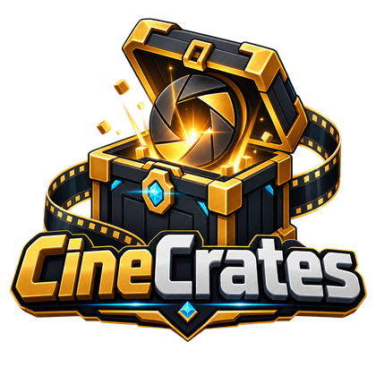

  

# CineCrates

以鏡頭演出為核心的 Minecraft 抽獎箱系統。單一 jar 同時支援 Spigot、Paper 與
Folia，涵蓋 1.21 到 26.x。

在 CineCrates 裡，一個箱子是一份 YAML 檔加上世界上的一個放置點。它跟「選單加上
轉盤動畫」的差別在於：開箱是一段**鏡頭演出**——相機可以被接管、沿著你編寫的路徑
飛行，模型播放自己的開箱動畫，而獎勵是在**真正定格的那一刻**才公布，不是在某個
寫死的時間點。

## 你能做出什麼

| | |
| --- | --- |
| **十種動畫樣式** | 從完整運鏡到 `instant`。除了 `cinematic` 以外全部**不需要任何座標**。 |
| **真實機率的獎勵** | 加權獎勵、一次開出多件、保底必得，以及一個把機率**算出來**而非讓你填數字的預覽介面。 |
| **要不要用鑰匙都行** | 實體鑰匙、死亡不會掉且離線也能發放的虛擬餘額、透過 Vault 收費、權限節點，或完全免費。 |
| **自己編排時間軸** | 音效、粒子、標題、ActionBar、主控台指令與運鏡，各自帶自己的 tick 偏移。 |
| **不需要模型外掛** | BetterModel 與 ModelEngine 會自動偵測且皆為選用；`block: CHEST` 就能得到行為完全相同的方塊型箱子。 |

## 從哪裡開始

剛裝好的話，先走一遍[安裝](getting-started/installation.md)與
[建立第一個箱子](getting-started/first-crate.md)——大約十分鐘，結束時你會有一個
可以點的箱子。

那個跑通之後，[箱子檔案結構](crates/anatomy.md)會從頭到尾走一遍完整設定，每個
段落都連到深入說明的頁面。

## 關於本文件的範例

文件裡的每一段設定都取自外掛實際解析得動的設定檔。凡是**容易弄錯**的地方——獎勵
時機背後的兩套時鐘、為什麼左鍵可能點不到模型箱子——都會明講，而不是留給你自己
踩到才發現。
