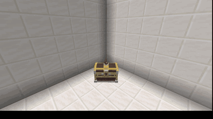

# 運鏡演出

`animation: cinematic` 會接管玩家的相機，讓它飛過你編排的演出。這是**唯一**需要
座標的動畫。

## 蓋房間

1. 在任何你喜歡的地方蓋好場景——多數人會用一間看不到的封閉房間，但放哪裡都行。
2. 站在**箱子模型**該出現的位置，執行：

   ```
   /crate admin setmodel <crate>
   ```
3. 站在**相機**該待的位置、看著模型，執行：

   ```
   /crate admin setcam <crate>
   ```
4. 讓箱子使用這個房間：

   ```yaml
   open-location: cinematic
   ```

兩個指令都會記錄你**腳下的位置**加上你面對的方向。


`setcam` 記錄的是你**執行當下**看的角度。如果之後用 `setmodel` 移動了模型，
**要重新執行 `setcam`**——否則相機會繼續指向模型原本的位置，演出就會對著空地板。


## 這個區段裝了什麼

```yaml
cinematic:
  enabled: true
  model-location: world,18.7,73.0,107.8,-43.8,4.6
  camera-location: world,22,74,111,134.6,22.1
  length-ticks: 170          # 演出總長度(20 tick = 1 秒)
  skippable: true
  open-animation: open       # 要播放的模型動畫
  reward-delay: 70           # 獎勵何時出現
```

`enabled: false` 可以在不刪除座標的情況下關掉整段運鏡。

## 運鏡路徑

在箱子的時間軸加上 `camera_move` 步驟，相機就會以平滑的緩動在它們之間滑行：



```yaml
cinematic:
  tasks:
    - { delay: 10,  type: camera_move, to: 'world,24,73,108,110,40', duration: 50 }
    - { delay: 65,  type: camera_move, to: 'world,21,72,111,150,35', duration: 45 }
    - { delay: 125, type: camera_move, to: 'world,23,75,112,135,52', duration: 35 }
```

| 鍵 | 意義 |
| --- | --- |
| `delay` | 從開箱起算的 tick 數 |
| `to` | 目的地，格式與 `setcam` 寫出來的一樣 |
| `duration` | 移動耗時的 tick 數。`0` 是瞬間切換。 |

編寫路徑最簡單的方法：站在你想要的相機位置，執行
`/crate admin setcam <crate>`，把它寫出來的座標複製到一行 `camera_move` 裡。
每個waypoint 重複一次。

`delay` 落在 `length-ticks` 之後的步驟**永遠不會執行**——加了比較晚的 waypoint
就要把長度調大。

## 相機模式

```yaml
# config.yml
cinematic:
  camera-mode: spectator      # spectator | packet | teleport
  camera-eye-offset: 1.62
  camera-teleport-duration: 1
```

`spectator` 是預設值，在兩種模型後端上都能運作。`camera-eye-offset` 存在的原因是
`setcam` 記錄的是你**腳下**的位置——這個偏移把相機放回眼睛高度，所以你執行指令當下
看到的畫面就是演出呈現的畫面。

`camera-teleport-duration` 控制客戶端對每次相機跳躍做多少平滑。它**只平滑相機的
位置**；朝向是封包一到就套用。數值大於每 tick 的移動間隔時，視線會跑在位置前面，
運鏡就會讀起來像在抖——`1` 讓兩者同步。想要更柔但更延遲的滑行就調高，`0` 則關閉
平滑。

## 當機復原

若伺服器在演出中途停止，那次被中斷的開箱會在玩家**下次登入時接手**：玩家被還原到
原本站的位置，遊戲模式與飛行狀態都放回去，獎勵照常發放而不是消失。這不需要任何設定。
