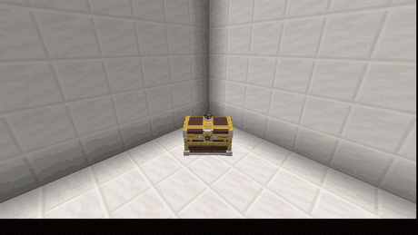
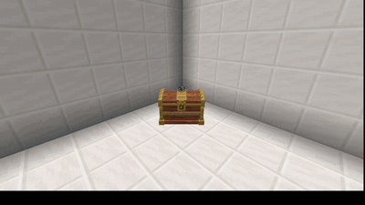
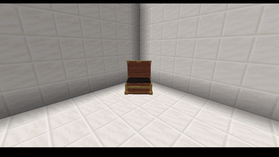

# 選擇動畫

```yaml
animation: cinematic
```

一個箱子只有一種動畫。**除了 `cinematic` 以外全部不需要任何座標**——不用蓋房間、
不用對齊任何東西。設好樣式、放上箱子，就這樣。

| 樣式 | 玩家看到什麼 |
| --- | --- |
| `cinematic` | 相機被接管並鎖定；演出可以沿著你編寫的路徑走。 |
| `in-place` | 獎勵從箱子原地彈出。 |
| `three-toss` | 三件物品往左／中／右拋出；贏家留下，輸家爆煙消失。 |
| `roulette` | 物品繞著環圈轉動並逐漸停下。 |
| `fountain` | 收尾時一次噴出所有獎勵的爆發。 |
| `rain` | 獎勵從上方落下。 |
| `spiral` | 從箱子爬升而出的螺旋。 |
| `beam` | 一道光柱把獎勵帶上去。 |
| `gui` | CS:GO 風格的橫向捲動條加上指針。 |
| `instant` | 沒有動畫，獎勵直接進背包。 |



*`cinematic` —— 相機被接管，獎勵落在鏡頭之內。*



*`roulette` —— 物品繞著箱子轉動並逐漸停下。*



*`fountain` —— 收尾時一次噴出所有獎勵的爆發。*

`in-place`、`three-toss`、`roulette`、`fountain`、`rain`、`spiral` 與 `beam` 在
本文件中合稱**原地家族**——它們共用同一套舞台程式與同一組調校鍵。

## 在哪裡演出

```yaml
open-location: placement     # placement(預設)| cinematic
```

`placement` 在玩家點擊的那個箱子上演出。`cinematic` 會把玩家帶到一個你只需要蓋
一次的房間，位置由 `cinematic:` 區段的座標決定。

對原地家族來說，這只是決定玩家留在原地還是被帶去房間。對 `animation: cinematic`
來說演出一定會發生——這只決定它在哪裡佈置，而 `placement` 會把**整段演出**（運鏡
路徑、模型與獎勵落點）搬到被點擊的那個箱子上，並轉到那個箱子的朝向。這樣一組相機
設定就能涵蓋地圖上的每一個放置點。

## 調整環繞類樣式

`roulette` 與 `spiral` 共用一個區段：

```yaml
orbit:
  radius: 1.15     # 環圈多寬
  scale: 0.55      # 每件物品渲染多大
```

省略的話，每種樣式各自保留自己的預設值。

## 調整輪播

```yaml
cinematic:
  rumble-length: 40    # 物品定格前循環多久
  rumble-period: 4     # 每幾 tick 換一次展示的物品
```

這兩個鍵住在 `cinematic:` 區段裡，但**對原地家族也有效**——那個區段裝的是所有樣式
的時間設定，不只運鏡那一種。`rumble-length` 很短時仍會有最低限度的旋轉，讓「慢下來」
的感覺讀得出來。

每一步播放的音效是全伺服器共用的：

```yaml
# config.yml
cinematic:
  rumble-sound: ui.button.click
  rumble-volume: 0.7
```

## 跳過

```yaml
cinematic:
  skippable: true
```

允許玩家用 Shift 跳出運鏡。獎勵的發放與動畫正常播完**完全一樣**——跳過永遠不會有
任何損失。
